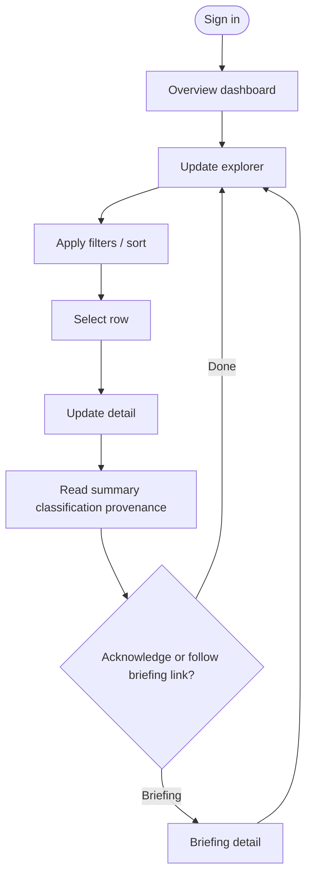
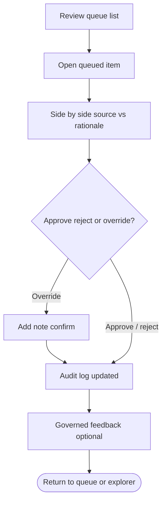
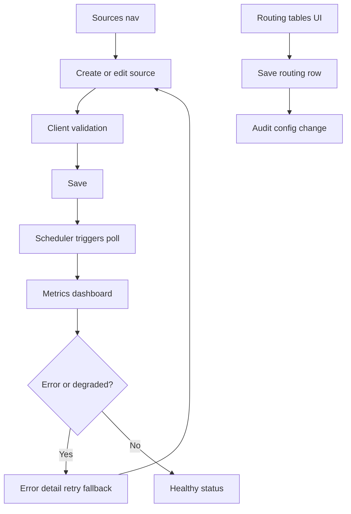
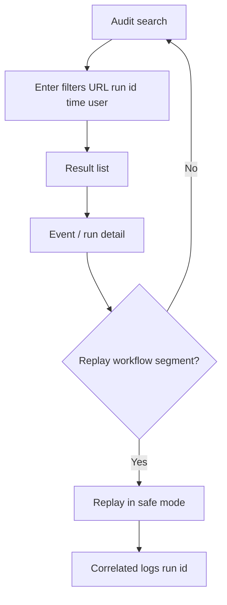

---
stepsCompleted:
  - 1
  - 2
  - 3
  - 4
  - 5
  - 6
  - 7
  - 8
  - 9
  - 10
  - 11
  - 12
  - 13
  - 14
lastStep: 14
workflow: bmad-create-ux-design
status: complete
completedAt: "2026-04-12T23:59:00Z"
inputDocuments:
  - _bmad-output/planning-artifacts/prd.md
  - _bmad-output/planning-artifacts/product-brief-sentinel-prism.md
  - _bmad-output/planning-artifacts/product-brief-sentinel-prism-distillate.md
  - _bmad-output/planning-artifacts/architecture.md
  - _bmad-output/planning-artifacts/epics.md
supportingAssets:
  - _bmad-output/planning-artifacts/ux-design-directions.html
  - _bmad-output/planning-artifacts/ux-color-themes.html
---

# UX Design Specification — Sentinel Prism

**Author:** Jack
**Date:** 2026-04-12

---

## Executive Summary

### Project Vision

**Sentinel Prism** is an **agentic compliance monitoring** product for **pharmaceutical regulatory intelligence**. It continuously ingests **public** regulatory signals, **normalizes** them into structured updates, **classifies** impact and confidence, **composes briefings**, and **routes** prioritized findings to the right people via a **web console** and **notifications**. The experience must reinforce **trust**: every surfaced item shows **why it matters**, **confidence**, and **source provenance**, with **auditability** and **human review** for ambiguous or high-risk cases—not a raw feed or a black-box score.

### Target Users

| Persona | Role | Primary goals |
|--------|------|----------------|
| **Mara (Analyst)** | Regulatory analyst | Daily triage: scan severity, open high-impact items, use review queue for low-confidence cases, read briefings, acknowledge or act without re-reading raw feeds. |
| **Jordan (Admin)** | Compliance / ops admin | Register and tune **public** sources, schedules, parsers, **mock routing** tables; monitor **per-source health**; recover from failures without engineering for routine changes. |
| **Sam (Engineer / operator)** | Platform / SRE | **Search** audit history by update, source, time, user; **replay** workflow segments with **run id** correlation for incidents. |

**RBAC personas (console):** **Admin** (sources, routing, users), **Analyst** (review, override, feedback), **Viewer** (read-only). **Regulatory Affairs / Compliance** is the **business owner** of golden-set “correctness”; their workflows touch **evaluation config** and policy (Epic 7).

### Key Design Challenges

1. **Trust and explainability** — Users must see **rationale**, **confidence**, and **evidence links** without digging through logs; the UI must not feel like “AI said so.”
2. **Alert fatigue vs speed** — Surface **critical** items quickly while batching or bundling lower-noise work; dashboards and filters must match mental models (jurisdiction, topic, severity).
3. **Dense regulatory content** — Long guidance text needs **scannable** layouts (hierarchy, side-by-side raw vs normalized, clear typography).
4. **Human-in-the-loop** — Review queue, **override with notes**, and **governed** threshold/prompt changes must feel **authoritative** and **audited**, not buried settings.
5. **Accessibility and enterprise posture** — **WCAG 2.1 Level A** minimum on primary flows (keyboard, labels); desktop-first, tablet usable.
6. **Safety framing** — Clear that outputs are **decision support**, not filings; **no** outbound binding regulatory actions (reinforced in UX copy and admin surfaces).

### Design Opportunities

1. **Single system of record** — Replace spreadsheet + inbox chaos with a **unified** explorer, briefings, and notifications tied to the same **update id** and **run id**.
2. **Explainability-first patterns** — Standard blocks for **what changed**, **why it matters**, **who should care**, **confidence**, **suggested actions** (PRD briefing model).
3. **Operable configuration** — Source registry and routing tables as **first-class** screens with **health metrics** and errors that admins can act on.
4. **Operator confidence** — Audit search and **replay** UX that makes **correlation** obvious (API → worker → graph) for Sam’s flows.
5. **Governed change** — Visible **configuration history** for golden-set and eval baselines so business and engineering roles align (FR44–FR45, NFR13).

---

## Core User Experience

### Defining Experience

The **core loop** is: **discover → understand → trust → act (or escalate)**. The most frequent action is **reviewing prioritized regulatory updates** in context—filters, severity, jurisdiction, then **detail** with **normalized vs original**, **classification rationale**, **confidence**, and **provenance**. Secondary but critical loops: **admin** configures sources and routing; **analyst** clears the **review queue** with overrides; **operator** traces **audit** and **replay**. If **triage + explainability** feels effortless, the product wins; if users revert to raw email/RSS, it fails.

### Platform Strategy

- **Primary:** **Web** SPA (**React + Vite + TypeScript** per architecture), **REST/OpenAPI** only—no direct graph coupling from UI.
- **Interaction:** **Desktop-first**, **mouse/keyboard** primary; **responsive** so tablet is usable for read-heavy tasks.
- **MVP deployment:** **Single-org** acceptable; UX should not assume multi-tenant chrome but may show **tenant-ready** labels only if useful later.
- **Offline:** Not required for MVP; **read-only degradation** if notifications fail (NFR7) should be reflected in messaging, not full offline mode.
- **Auth:** **Local** login (password / magic link) this phase; flows must leave room for future **SSO** without renaming “you” in audit (**FR46**, **NFR14**).

### Effortless Interactions

- **Open an update** and immediately see **why it’s in scope**, **severity**, **confidence**, and **link to source**—no extra clicks for the default insight.
- **Filter/sort** the explorer by dimensions users name in journeys (date, jurisdiction, topic, source, status).
- **Review queue**: one place for **approve / reject / override + note** with clear **audit** outcome.
- **In-app notifications** that deep-link to the right update or briefing.
- **Admin**: enable/disable source, see **last success**, **errors**, **retry** story without SSH.

### Critical Success Moments

- **“I trust this triage”** — First time a user compares a **critical** item to raw source and agrees with **rationale + confidence**.
- **Review path** — Resolving a **low-confidence, high-impact** item with **override** and seeing it **logged** and **fed back** without silent rule changes.
- **Admin win** — Adding a **new RSS** and seeing **metrics** after poll without a developer.
- **Sam’s moment** — **Search** by URL/run id and **replay** explains **why we alerted** last Tuesday.
- **Failure that kills trust** — Wrong severity with **no** provenance, **silent** config change, or **unexplained** model output.

### Experience Principles

1. **Evidence before opinion** — Always show **provenance** and structured **why** next to any score or label.
2. **Severity-first, noise-aware** — Visual and information hierarchy privilege **critical/high**; don’t bury action in dashboards.
3. **Human authority** — Review and override are **first-class**; automation assists, does not replace accountability.
4. **Configurable without code** — Sources and routing behave like **products**, not tickets.
5. **Audit-native** — Every meaningful action is **findable** later (user, time, run id).
6. **Accessible by default** — Primary flows meet **WCAG 2.1 Level A**; improve to **AA** where cheap (**NFR11**).

---

## Desired Emotional Response

### Primary Emotional Goals

- **Trust (grounded, not blind)** — Users should feel that the system is **honest about uncertainty**: confidence scores, review queues, and disclaimers work *with* them, not *over* them.
- **Calm control** — **In control** of triage and configuration—**not** overwhelmed by raw feeds or opaque automation. The dominant feeling is **focused competence**, not adrenaline (except where **critical** items rightly demand urgency).
- **Relief** — Relief from **inbox/RSS chaos** and “did we miss something?”—replaced by **clarity** about what was monitored, what was concluded, and what was sent to whom.
- **Professional pride** — Analysts and admins can **stand behind** audit narratives in front of auditors or leadership: **explainable**, **logged**, **replayable**.

### Emotional Journey Mapping

| Stage | Desired feeling | UX support |
|--------|------------------|------------|
| **First login / onboarding** | Oriented, not lost; **safe** to explore (viewer/analyst paths) | Clear role-appropriate home; decision-support disclaimer visible but not alarmist |
| **Daily triage (core)** | **Efficient**, **confident** in sorting signal from noise | Severity-first layouts, fast filters, scannable detail |
| **High-impact / low-confidence item** | **Alert but supported**—tension acknowledged, **path** to resolution clear | Review queue prominence, side-by-side source vs rationale, override + note |
| **Admin / config** | **Empowered**, not “only engineering can fix this” | Source health, errors, retries surfaced; saves feel **reversible** where policy allows |
| **After task complete** | **Closure** — item acknowledged, briefing read, notification understood | Clear states: read/acknowledged, delivery outcome visible |
| **When something fails** | **Informed**, not panicked—**actionable** errors, no dead ends | NFR7-style degradation messaging; admin paths to fix channel/source issues |
| **Return visit** | **Familiarity** — “this is my cockpit” | Consistent patterns; run id / update id always findable for Sam |

### Micro-Emotions

| Pair | Target for Sentinel Prism |
|------|---------------------------|
| **Confidence vs. confusion** | **Confidence** in *process* (provenance, audit); allow **productive** confusion only where uncertainty is real—then route to **review**, not fake certainty. |
| **Trust vs. skepticism** | **Trust** earned by **showing work** (evidence, versions); avoid “magic” language for classifications. |
| **Excitement vs. anxiety** | **Measured urgency** for critical items; **reduce ambient anxiety** via bundling and clear backlog counts—not constant red alerts. |
| **Accomplishment vs. frustration** | **Accomplishment** when queue clears or source is healthy; **minimize frustration** from broken parsers (clear errors, retries). |
| **Delight vs. satisfaction** | **Satisfaction** is primary (enterprise tool); **delight** only in small moments—e.g. fast search, crisp briefing layout—not playful gimmicks. |
| **Belonging vs. isolation** | **Shared accountability** — routing and briefings connect the **right** stakeholders; audit shows **who** was notified. |

### Design Implications

- **Trust** → Always pair **labels** with **evidence** and **confidence**; use **review** and **override** patterns, not only badges.
- **Calm control** → **Dashboard** density disciplined; **progressive disclosure** for long regulatory text; **batch/digest** patterns for non-critical noise.
- **Relief** → Strong **empty and steady states** (“nothing critical today”) as positive feedback.
- **Urgency without panic** → **Critical** uses **urgent** visual weight + **clear next step**, not alarmist copy.
- **Failure** → **Blame-aware** copy focuses on **system/source/channel**, gives **retry** or **escalation** path; never “something went wrong” alone.
- **Professional / audit context** → Export and audit views feel **forensic** and **complete**, not marketing.

### Emotional Design Principles

1. **Honest uncertainty** — The UI **admits** low confidence; it never **cosplays** certainty.
2. **Earned trust** — Trust comes from **traceability**, not branding superlatives.
3. **Quiet when possible, loud when necessary** — Visual and notification volume tracks **severity** and **user role**.
4. **Respect the regulator context** — Tone is **precise**, **neutral**, **non-patronizing**; avoid consumer-app whimsy.
5. **Recoverability** — Emotional safety: users can **fix** misclassification and **see** that the fix was **recorded**.

---

## UX Pattern Analysis & Inspiration

_Advanced elicitation (First Principles + Pre-mortem) was used to stress-test “glass” visuals against regulatory readability, audit density, and accessibility—then merge with your direction: **Apple Liquid Glass** as craft reference, **enterprise tone** preserved._

### Inspiring Products Analysis

**Reference categories (analogous to Sentinel Prism goals):**

| Category | Why it matters | UX strengths to learn from |
|----------|----------------|-----------------------------|
| **Ops / APM / monitoring** (e.g. Datadog, Grafana, cloud consoles) | Sam’s audit/replay mindset; per-source health | **Correlation ids**, time-range investigation, **severity** coloring without clownish reds; **facet filters**; dense tables that stay scannable |
| **Modern issue / work tracking** (e.g. Linear, Jira when well configured) | Review queue, ownership, state | **Triage-first** lists, **keyboard** affordances, clear **state** (new / in review / done), **comments** tied to entities |
| **Email / collaboration** (e.g. Outlook, Gmail, Slack) | Notification + “what needs attention” | **Inbox mental model** (unread counts), **threading** metaphor for related updates; **mute/batch** patterns for noise—**adapt carefully** so regulatory nuance isn’t lost |
| **Knowledge / wiki** (e.g. Confluence, Notion—enterprise) | Briefings as readable narratives | **Stable heading hierarchy**, **anchors**, **templates** for recurring briefing sections (maps to PRD briefing fields) |
| **Apple platform craft (Liquid Glass era)** | **Calm precision**—spacing, motion, depth as **information hierarchy**, not ornament | **Layered surfaces** that separate **chrome vs content**; **subtle depth** for focus; **motion** that explains state change (panel focus, expansion) with **restraint**; **minimal** decoration so **text and evidence** stay sovereign |

**Sentinel Prism twist:** Unlike pure monitoring, users need **legal-grade provenance** and **human authority**—so we borrow **clarity** from ops tools, **workflow** from issue trackers, and **readability** from docs tools, without becoming a generic ticket system or a social feed. **Liquid Glass** is imported as **interaction and visual discipline**—not consumer playfulness.

### Liquid Glass–inspired visual language (enterprise)

Use **Apple-grade polish**—**calm**, **precise**, **minimal**—while keeping **forensic** enterprise/regulatory tone.

| Principle | What to adopt | What to refuse |
|-----------|----------------|----------------|
| **Hierarchy through depth** | **Subtle** elevation: nav / inspector / modal layers read as **stacked planes**; **focus** draws a **soft** foreground (e.g. review drawer above list) | Toy-like **glow**, **neon**, or **excessive** blur that reads as marketing |
| **Materials** | **Selective** translucency for **secondary chrome** (side nav, toolbars, sticky headers) so **content** (updates, source text, audit tables) sits on the **most stable** surface | Frosted **data cells** or **blurred body text**—fails readability and WCAG |
| **Spacing & rhythm** | **Generous** vertical rhythm in briefings and detail; **consistent** 8pt (or 4/8) grid; **breathing room** around **severity** and **confidence** chips | Cramped regulatory walls of text without hierarchy |
| **Motion** | **Short** durations, **ease** curves that feel **physical** but **subdued**; motion explains **state** (drawer, expand, save success)—**respect `prefers-reduced-motion`** | Bouncy springs, **parallax** over content, **delight** animations that delay triage |
| **Typography** | **System-like** discipline: clear **title / body / caption**; **tabular figures** for ids and timestamps; **no** novelty display fonts | Playful rounded **display** type for dense tables |
| **Color** | **Neutral** base with **semantic** accents (severity) + **muted** chrome; **contrast** first (NFR11) | Candy gradients on **critical** alerts |

**Pre-mortem (what goes wrong if “glass” is misapplied):** contrast loss on long sessions; **blur** hurting **small text** in tables; motion distracting during **audit**; performance cost on low-end machines. **Mitigations:** keep **blur** to chrome; **solid** backgrounds for **primary reading** and **data grids**; **reduce** effects in **high-density** modes; test **WCAG** contrast on **semantic** surfaces.

### Transferable UX Patterns

**Navigation**

- **Left rail:** Overview → Explorer → Review queue → Briefings → Sources → Routing → Audit / Ops → Settings (exact labels TBD)—mirrors **mental model** in PRD journeys. **Liquid Glass:** rail as a **quiet** secondary plane; active item uses **weight + subtle fill**, not loud color blocks.
- **Persistent global search** (updates, ids, URLs) for Sam; **scoped search** inside audit view.
- **Breadcrumbs** on deep detail (explorer → update → tab).

**Interaction**

- **Master–detail** for explorer (list + preview pane) on desktop; stacked on narrow widths. **Transition** between list and detail: **shared-axis** motion (slide/fade 150–220ms) per reduced-motion rules.
- **Side-by-side** raw vs normalized (FR9) as **split pane** or tabbed “Source | Normalized” with shared scroll anchor where possible.
- **Review actions** as a **sticky action bar** on detail: approve / reject / override + required note when policy demands—**elevated** surface, **clear** separation from evidence.
- **Admin tables:** inline edit or drawer for routing rows; **destructive** actions (disable source) with **confirm** and audit preview.

**Visual**

- **Severity** as **semantic color + icon + text** (never color-only—NFR11).
- **Confidence** as **numeric + plain-language band** (e.g. low / medium / high) next to model version link.
- **Density toggle** where power users need more columns (analyst) vs viewer simplified columns—**glass** effects **scaled back** in **dense** mode.

### Anti-Patterns to Avoid

- **Wall of alerts** — undifferentiated red badges; every item “urgent.” Mitigate with **severity-first** layout and **digest** for non-critical.
- **Black-box AI** — scores with no **rationale**, **source**, or **version**. Mitigate with mandatory **evidence** blocks and **review** path.
- **Feed-only UI** — endless chronological list with no **filters** or **briefings**. Mitigate with **explorer filters** + **briefing** as first-class destination.
- **Settings archaeology** — routing and sources buried in nested settings with no **health** surfacing. Mitigate with **Epic 2/6** patterns: sources and routing as **primary** nav for admins.
- **Playful / gamified enterprise SaaS** — streaks, confetti, cute copy. Conflicts with **professional trust** and **regulated context**.
- **Silent failures** — toast-only errors with no **retry** or **admin** path. Mitigate with **actionable** error surfaces (NFR10).
- **Decorative Liquid Glass** — blur/gloss **on** tables, **body copy**, or **critical** warnings. **Fails** trust and **accessibility**.
- **Motion for mood** — animation that **doesn’t** communicate state. **Violates** calm, precise operator expectations.

### Design Inspiration Strategy

**Adopt**

- **Ops-style investigation** (time range, facets, run id) for **audit and replay**.
- **Issue-tracker triage** for **review queue** (states, notes).
- **Document-style briefing** templates aligned to PRD **what / why / who / confidence / actions**.
- **Liquid Glass craft:** **layered** UI hierarchy, **subtle** depth, **purposeful** motion, **generous** spacing—**content and evidence** always win.

**Adapt**

- **Inbox counts** → **severity-weighted** summaries and **review backlog**, not raw unread only.
- **Monitoring dashboards** → emphasize **regulatory** dimensions (jurisdiction, topic) not just infra metrics.
- **Apple-style surfaces** → **enterprise** neutrals and **semantic** severity palette; **no** consumer whimsy; **dense** and **accessible** modes dial back **material** effects.

**Avoid**

- **Chronological-only** social feeds; **opaque** ML scores; **consumer** gamification; **one-size** density for analyst vs viewer.
- **Glass-for-glass’s-sake** on **data** or **legal** text; **low-contrast** frosted panels over **critical** actions.

---

## Design System Foundation

### 1.1 Design System Choice

**Primary approach: Themeable headless primitives + utility styling**

- **Component layer:** **Radix UI**-based patterns (e.g. **shadcn/ui** on **Tailwind CSS**) for **accessible** primitives (dialog, sheet, dropdown, tabs, tooltip) with **full control** over surfaces, motion, and density.
- **Styling:** **Tailwind** for **design tokens** (spacing, radius, elevation, blur **only** where allowed), **dark/light** readiness optional later.
- **Data density:** Pair with a **table** strategy that supports **dense mode** (e.g. **TanStack Table** + custom styling)—**no** frosted **cell** backgrounds; **solid** rows for readability.

**Alternative (if team prefers batteries-included):** **MUI** (Material) with a **heavily customized** theme toward **neutral** surfaces and **subtle** elevation—faster for complex data UI, slightly more work to reach **Apple-like** restraint.

**Decision for Sentinel Prism (MVP):** **shadcn/ui + Tailwind** as default recommendation unless the team already standardized on MUI.

### Rationale for Selection

- **Architecture** already assumes **React** SPA and **REST**—component library must be **React-native** and **tree-shakeable**.
- **NFR11** favors **accessible primitives** (focus, labels, keyboard)—Radix family is strong.
- **Liquid Glass** needs **token-level** control (blur, shadow, layer)—**Tailwind + CSS variables** fit better than opaque widget defaults.
- **Enterprise + regulatory:** **Neutral** chrome, **semantic** severity colors, **no** stock “playful” defaults—custom theme is **expected**.

### Implementation Approach

- Add **global tokens**: `--surface-base`, `--surface-chrome`, `--elevated`, `--blur-chrome` (use **sparingly**), **motion** durations (e.g. 150–220ms), **easing** curves.
- **Layers:** **Content** = highest contrast, often **solid**; **nav/toolbars** = optional **translucency**; **modals/drawers** = **elevated** plane + motion.
- **Tables/audit:** **Solid** backgrounds; **zebra** or **border** hierarchy instead of glass.
- **Respect** `prefers-reduced-motion`: cross-fade / instant toggles as fallback.

### Customization Strategy

- **Brand:** restrained **neutral** palette + **semantic** colors for severity; **no** loud marketing gradient on **critical** paths.
- **Liquid Glass:** implement as **systematic** rules (where blur is allowed, max blur, min contrast), not ad-hoc per screen.
- **Future:** optional **design tokens** export for **Figma** parity; align **Epic 6** stories to **shared** components (dashboard cards, explorer list/detail, review drawer).

---

## 2. Core User Experience

### 2.1 Defining Experience

**The defining interaction:** *Open any regulatory update and—in one composed view—see **what changed**, **why it matters to us**, **how confident we are**, **where the evidence is**, and **what to do next**—without opening raw feeds or log lines.*

If Sentinel Prism nails **explainable triage** (list → detail → action/review), analysts adopt it as the **system of record**; if detail feels **opaque** or **fragmented**, they revert to **inbox + spreadsheets**.

**Elevator description:** “It’s the place where **public regulatory change** becomes **actionable, auditable intelligence**—with **humans** in the loop when the model isn’t sure.”

### 2.2 User Mental Model

- **Today:** Email/RSS **firehose**, **manual** copy into trackers, **tribal knowledge** for “did we already see this?”, **ad hoc** audit stories.
- **Expectation:** A **single console** where **items** are **first-class** (ids, severity, jurisdiction), **routing** is **explicit**, and **decisions** are **logged**. Users expect **enterprise software** reliability—not a **consumer** feed.
- **Confusion risks:** Treating classification as **magic**; **hiding** confidence; mixing **critical** with **noise**; **burying** override/review; **unclear** “what was sent to whom.”
- **Liquid Glass alignment:** **Chrome** recedes; **content** (title, body, rationale, evidence links) **reads** as the **foreground**—consistent with **calm precision**.

### 2.3 Success Criteria

- **Comprehension:** Users can answer **why this item is here** and **how serious it is** in **under 30 seconds** on first open (target for typical updates).
- **Trust:** **100%** of **critical/high** presentations expose **rationale + confidence + path to source** (per PRD success themes).
- **Speed:** **Overview** primary widgets within **NFR1**; **classification** latency is backend-bound—UI must **never** block on **layout thrash** or **mystery** loading.
- **Closure:** **Acknowledge**, **override**, or **route to review** yields **visible** confirmation + **audit** linkage.
- **Accessibility:** Primary path operable with **keyboard** and **screen reader** labels for **severity**, **confidence**, and **actions** (NFR11).

### 2.4 Novel UX Patterns

- **Mostly established:** **Master–detail** explorer, **queues**, **dashboards**, **admin CRUD** for sources/routing, **notification** centers.
- **Composite differentiator:** **Explainability stack**—**structured** blocks (impact, rationale, confidence, provenance, suggested actions) **always** in the same **detail** pattern, not ad-hoc per screen.
- **Education burden:** Low—users know **tables**, **filters**, **drawers**; the **novel** part is **consistency** of **trust fields** everywhere.
- **Unique twist:** **Run id / correlation** exposed **where operators** need it (Sam) without **cluttering** analyst default view—**progressive disclosure**.

### 2.5 Experience Mechanics

**1. Initiation**

- User lands on **Overview** (counts, review backlog, top sources) or goes straight to **Explorer** from nav.
- **Filters** (date, jurisdiction, severity, topic, source, status) narrow the set; **sort** defaults to **newest + severity**.

**2. Interaction**

- User selects a **row**; **detail** opens (pane or route) with **tabs/sections**: **Summary** | **Source vs normalized** | **Classification** | **Routing & notifications** | **Audit** (role-dependent).
- **Primary read:** **Title**, **severity**, **confidence**, **rationale**, **link to evidence** above the fold.
- **Actions** in a **sticky** region: **Acknowledge**, **Send to review**, **Override** (analyst), constrained by **RBAC**.

**3. Feedback**

- **Inline** save states (**saving / saved**); **toast** optional, **non-blocking**.
- **Errors** are **specific** (source fetch, parse, channel)—with **retry** or **admin** path where applicable.
- **Motion:** **subtle** panel transition (Liquid Glass layer shift); **reduced motion** = instant/cross-fade.

**4. Completion**

- User sees **confirmation** and can **return** to list with **row state** updated (read/acknowledged).
- **Next:** next item in **queue**, return to **Overview**, or open **briefing** linked to the update.

---

## Visual Design Foundation

### Color System

**Brand:** No separate brand guideline artifact—default to a **neutral, cool enterprise** base (near **Apple system grays** in spirit: clarity over saturation).

| Role | Intent | Notes |
|------|--------|--------|
| **Background / surface** | Calm reading; **solid** for primary content | Avoid frosted **body** text (per Liquid Glass rules) |
| **Chrome** | Nav, toolbars, secondary panels | Optional **subtle** translucency **only** if **contrast** passes **WCAG** for adjacent text/icons |
| **Border / divider** | Structure without heaviness | 1px hairlines; **semantic** separation |
| **Primary (action)** | One restrained accent for **primary** buttons/links | Not “marketing blue” by default—**precise** |
| **Semantic** | **Severity** + system feedback | **Critical / high / medium / low** mapped to **distinct** hue + **icon + text** (never color-only) |
| **Success / warning / danger** | Routing, delivery, config saves | Map to **muted** enterprise tones; **danger** reserved for destructive |

**Themes:** Ship **light** first (MVP); **dark** optional—audit tables and long-form reading must keep **contrast** in both.

**Accessibility:** Target **WCAG 2.1 AA** for **normal text** on **surface** where feasible; **minimum Level A** on all primary flows (NFR11). **Verify** severity chips and **glass** chrome with automated contrast checks + spot **color-blind** review.

### Typography System

**Tone:** **Professional**, **modern**, **neutral**—authority without coldness.

| Use | Recommendation |
|-----|----------------|
| **UI / product** | **System UI stack** where acceptable (`system-ui`, **SF Pro** on Apple clients); otherwise **Inter** or **IBM Plex Sans** as web-safe enterprise defaults via Tailwind |
| **Numeric / ids** | **Tabular lining figures** for timestamps, run ids, counts—prevents jitter in tables |
| **Long-form** (briefings, source text) | Slightly **relaxed** line-height (e.g. 1.5–1.6 body); **max line length** ~65–75ch in reading columns |

**Scale (indicative):** **Display / h1 / h2 / h3 / body / small / caption** with **consistent** step—**fewer** sizes than marketing sites; **density mode** steps down one notch for explorer tables.

**Accessibility:** Minimum **16px** body where possible; **user zoom** must not break **layout** (relative units, no fixed-height truncation on critical fields).

### Spacing & Layout Foundation

- **Base unit:** **4px** grid, **8px** as default **spacing** step (Tailwind-aligned); **generous** vertical rhythm on **briefing** and **detail** (Liquid Glass “breathing room”).
- **Density:** **Explorer / audit** = **compact** row height + **tight** vertical padding; **briefing reader** = **roomier**; user or role may toggle **comfortable / compact** where implemented.
- **Grid:** **12-column** fluid grid for **dashboard**; **master–detail** uses **fixed** nav + **fluid** main; **max width** on **reading** columns for legibility.
- **Elevation:** **2–3** meaningful levels (base, raised panel, modal)—**shadow** restrained; **depth** communicates **focus**, not decoration.

### Accessibility Considerations

- **Keyboard:** Full **primary** flows without pointer; **visible focus** rings (**never** remove for “minimal” look).
- **Screen readers:** **Severity**, **confidence**, and **state** (e.g. in review) exposed as **text**, not icons alone.
- **Motion:** **prefers-reduced-motion:** replace **slide** with **cross-fade** or **instant**; no **essential** information **only** in motion.
- **Tables:** **Headers** associated with cells; **sort** direction announced where applicable.

---

## Design Direction Decision

### Design Directions Explored

Eight static directions are rendered in **`ux-design-directions.html`** (Overview slice + sample rows): **A** Liquid Glass Enterprise, **B** Dense operations, **C** Split-first hierarchy, **D** Warm neutral, **E** High-contrast semantic severity, **F** Minimal flat, **G** Dark chrome shell, **H** Briefing-forward overview.

### Chosen Direction

**Primary: Direction A — Liquid Glass Enterprise**, with **Direction B (Dense ops)** as a documented **density variant** for explorer and audit tables.

**Optional later:** **Direction G** only if a **dark shell** is validated for contrast; **Direction H** patterns if the product prioritizes a **briefing-first** landing over raw explorer.

### Design Rationale

- **A** matches **Liquid Glass** rules: **chrome** may use subtle translucency; **tables and reading** stay **solid** and high-contrast.
- **B** supports **power users** and performance-sensitive views without changing **brand**—tighten spacing and type scale only.
- **C–F** remain as **reference forks** for brand or accessibility decisions; **E** needs explicit **contrast** verification if adopted for severity emphasis.
- **H** supports PRD **briefing** prominence if the roadmap shifts landing emphasis.

### Implementation Approach

- Implement **A** as the default **shadcn/ui + Tailwind** theme; add a **`density=compact`** mode reusing **B** spacing patterns.
- Keep **semantic severity** components as **icon + text + color** in all directions.
- Run **automated contrast** checks on **glass** nav and **E** severity text before promoting beyond **A**.

---

## User Journey Flows

Flows build on PRD **User Journeys** (analyst daily triage, review escalation, admin configuration, engineer audit/replay). Direction **A** (Liquid Glass shell, solid content) and **master–detail** patterns apply throughout.

### Analyst — Daily triage (success path)

**Goal:** Scan **severity**, open a **high** item, verify **rationale + confidence + provenance**, **acknowledge**, tie to **briefing**.

**Optimization:** Keep **filters** and **severity** visible in the **explorer** header; **detail** opens without losing list context (split pane or route with **back** to same filter state).

### Analyst — Review queue (low confidence / high impact)

**Goal:** Resolve **review** items: compare **source** to **rationale**, **note**, **override** severity; ensure **audit** and **governed** feedback—no silent rule changes.

**Recovery:** If **save** fails, **inline** error with **retry**; never **lose** the note text.

### Admin — Source and routing configuration

**Goal:** Register **public** source, set **schedule**, map **routing** to **mock** tables, observe **per-source metrics**; recover from **parser** errors.

### Operator — Audit search and replay

**Goal:** Find **update** by **URL** or **run id**; inspect **audit** chain; **replay** segment **non-destructively**.

### Journey patterns

| Pattern | Where used |
|--------|------------|
| **Master–detail** | Explorer, review queue |
| **Sticky actions** | Update detail, review resolution |
| **Progressive disclosure** | Operator **run id** deep dive |
| **Audit on commit** | Overrides, routing saves, source saves |
| **Role-gated nav** | Admin vs analyst vs viewer |

### Flow optimization principles

1. **Minimize steps to trust** — **Rationale + confidence + link** visible **without** extra clicks on default detail layout.
2. **Preserve context** — List **filters** and **scroll** restored when returning from detail where technically feasible.
3. **Explicit failure** — **Source** and **channel** errors show **what failed**, **when**, and **what to do** next.
4. **No dead ends** — **Review** and **audit** always offer **next** item or **return** to queue/search.
5. **Motion with purpose** — Panel transitions **only** when changing **scope** (e.g. detail opens); honor **`prefers-reduced-motion`**.

---

## Component Strategy

### Design system components

**Foundation (shadcn/ui + Radix + Tailwind):** **Button**, **Input**, **Textarea**, **Select**, **Checkbox**, **Switch**, **Tabs**, **Dropdown menu**, **Dialog**, **Sheet** (drawers), **Tooltip**, **Toast** / **Sonner**, **Badge**, **Card**, **Separator**, **Scroll area**, **Table** (primitives), **Form** + **Label**, **Avatar** (optional), **Skeleton**, **Breadcrumb**, **Navigation menu** (sidebar), **Popover**, **Command** (⌘K search optional later).

**Coverage:** Auth forms, settings, admin tables, modals, notifications, basic data display—**NFR11** affordances come from **Radix** focus management and **labels**.

**Gaps:** **Data grid** beyond simple table (sort, column hide, density)—use **TanStack Table** + design tokens; **charts** for metrics—add **Recharts** or **Visx** behind a thin wrapper when dashboard charts go beyond KPI cards.

### Custom components

#### SeverityBadge

**Purpose:** Communicate **critical / high / medium / low** with **icon + text + color** (never color-only).  
**Usage:** Explorer rows, detail header, briefings, notifications.  
**Anatomy:** Dot or icon, label, optional screen-reader suffix.  
**States:** Default, **muted** when row inactive.  
**Variants:** **Compact** (table), **comfortable** (detail).  
**Accessibility:** `aria-label` includes full severity string; not **only** `title`.  
**Content:** Uppercase or sentence case—**pick one** product-wide.

#### ConfidenceBlock

**Purpose:** Show **numeric** score + **band** (e.g. low / medium / high) + link to **model/prompt version**.  
**Usage:** Update detail, review queue.  
**States:** **Review suggested** callout when policy flags low confidence.

#### ProvenanceBlock

**Purpose:** **URL**, **fetched at**, **hash/snapshot** link, **source** name.  
**Usage:** Detail **Source** tab, audit.  
**Actions:** **Open external** (new tab), **copy link**.

#### UpdateDetailLayout

**Purpose:** Consistent **explainability stack**: title, severity, confidence, rationale, provenance, suggested actions.  
**Usage:** Core **defining experience** surface.  
**Interaction:** **Sticky** action region for **Acknowledge**, **Override**, **Send to review**.

#### ReviewActionBar

**Purpose:** **Approve**, **reject**, **override** + **required note** when policy requires.  
**Usage:** Review queue detail.  
**States:** **Disabled** until note valid; **saving**; **error** with retry.

#### SourceHealthCard

**Purpose:** **Last success**, **error rate**, **latency**, **enable** toggle, **link** to errors.  
**Usage:** Admin **Sources** list and detail.

#### RoutingRuleRow

**Purpose:** Editable **topic → team/channel**, **severity → channel** with **validation**.  
**Usage:** Routing UI (FR32).  
**Audit:** On save, show **what changed** in confirmation toast or inline.

#### AuditTimeline

**Purpose:** **Chronological** events with **run id** correlation, filter by **user** / **type**.  
**Usage:** Operator **audit** view, Sam’s journey.

#### BriefingDocument

**Purpose:** Structured **sections**: what changed, why it matters, who should care, confidence, suggested actions.  
**Usage:** Briefing list + detail; **print/export** friendly spacing.

### Component implementation strategy

- **Compose** custom blocks from **design-system** primitives; **tokens** for spacing, radius, **glass** on **chrome** only.
- **Co-locate** domain types in **frontend** (`Update`, `Classification`, `DeliveryEvent`) aligned with **OpenAPI** models.
- **Storybook** (or **Ladle**) optional but recommended for **SeverityBadge**, **ConfidenceBlock**, **UpdateDetailLayout** before Epic 6 scales.
- **Test:** **axe** on **SeverityBadge** + table row; **keyboard** path through **ReviewActionBar**.

### Implementation roadmap

**Phase 1 — Core (Epic 1 + shell + explorer read path)**  
`AppShell`, `Nav`, `PageHeader`, `DataTable` (TanStack), `SeverityBadge`, `UpdateDetailLayout` (read-only), `Button`, `Input`, auth **Form**.

**Phase 2 — Triage + review (Epic 4)**  
`ReviewActionBar`, `ConfidenceBlock`, `ProvenanceBlock`, `Sheet` for side-by-side source, **Toast** for save/errors.

**Phase 3 — Admin + routing (Epics 2, 5, 6)**  
`SourceHealthCard`, `RoutingRuleRow`, metrics **Card**s, **Dialog** confirm for destructive actions.

**Phase 4 — Audit + ops (Epic 8)**  
`AuditTimeline`, **filters** bar, **replay** modal / safe-mode framing (UI shell only).

**Phase 5 — Briefings + feedback (Epics 4, 7)**  
`BriefingDocument`, feedback **form** on detail, golden-set **config** history panel.

---

## UX Consistency Patterns

Patterns align with **shadcn/Radix**, **Direction A** (glass **chrome**, **solid** content), and **NFR11**.

### Button hierarchy

| Level | Use | Style |
|-------|-----|--------|
| **Primary** | Single main action per surface (e.g. **Save**, **Submit review**, **Apply override**) | One primary per **sticky** region or modal |
| **Secondary** | Non-destructive alternatives (**Cancel**, **Back**, **View briefing**) | Outline or subtle fill |
| **Tertiary** | Low-emphasis (**Copy link**, **Expand**) | Ghost / text button |
| **Danger** | **Disable source**, **destructive** delete | Distinct hue + **confirm** dialog; never **only** color |

**Rules:** Destructive actions require **Dialog** + **type to confirm** only when data loss is real; otherwise **single** confirm.

### Feedback patterns

| Type | When | UX |
|------|------|-----|
| **Success** | Save, override, routing row committed | **Inline** “Saved” or **toast** (non-blocking); include **audit** hint for governed changes |
| **Error** | API/network/validation | **Inline** on field or **banner** in panel; **retry** when applicable; **never** toast-only for **blocked** work |
| **Warning** | Degraded notification channel, stale data | **Banner** with **next step** |
| **Info** | Decision-support disclaimer, **mock** routing | **Persistent** subtle callout where legally required; dismissible only if policy allows |

**Loading:** **Skeleton** for dashboard/widgets; **row** skeleton for tables; **spinner** only for **short** blocking actions (under a few seconds). **Avoid** full-page spinners except **initial** app shell.

### Form patterns

- **Labels** always visible (not placeholder-only); **required** fields marked + **aria-required**.
- **Validation:** on **blur** for format; on **submit** for completeness; **errors** tied to fields with `aria-describedby`.
- **Admin** long forms: **sections** with **sticky** section nav or **stepper** only if truly sequential.
- **Routing/source** edits: **diff** or summary on save when **audit** expects clarity.

### Navigation patterns

- **Left rail** persistent on desktop; **active** state = **weight + tint**, not only color.
- **Mobile / narrow:** **hamburger** → **sheet** menu; **deep** links still land on correct **route**.
- **Breadcrumbs** on detail when more than two levels deep.
- **Role-based:** hide **nav** items user cannot access (do not **disable** only—reduces noise).

### Additional patterns

**Empty states:** **Explain** why empty (filters too tight vs. truly no items); **primary** CTA to **clear filters** or **add source** (admin).

**Modal vs sheet:** **Sheet** for **contextual** edit while keeping list visible (review, quick edit); **Dialog** for **confirm** and **short** forms.

**Search / filter:** **Filter** chips removable; **query** persisted in URL where possible for **share** and **back** button.

**Notifications:** **In-app** list with **read** state; **deep link** to **update**; **critical** badge on **nav** only when count is greater than zero.

**Density:** **Comfortable** default for **briefings**; **compact** for **explorer/audit**—toggle if implemented.

### Design system integration

- Map patterns to **Radix** primitives (**Dialog**, **Sheet**, **Toast**); **tokens** for **primary/secondary/destructive**.
- **Glass:** apply to **nav/shell** only; **forms** and **tables** stay **opaque** backgrounds.

---

## Responsive Design & Accessibility

### Responsive strategy

**Desktop (primary — PRD):** **Multi-column** where useful: **left nav** + **main** + optional **detail** third column for **master–detail** explorer. Use **extra width** for **side-by-side** raw vs normalized (**FR9**), **wide** audit tables, **dashboard** KPI grid. **Density toggle** maps here first.

**Tablet:** **Usable** for read-heavy tasks (PRD). **Collapsible** detail: **stack** list → detail on selection; **split** when landscape allows. **Touch** targets at least **44×44px** on interactive chrome.

**Mobile (secondary):** **Not** the primary canvas for dense triage; support **login**, **notifications**, **read-only** update detail, **acknowledge** where safe. **Hamburger** → **sheet** nav; **tables** become **card lists** or **horizontal scroll** with care (prefer **cards** + key fields). **Defer** complex **admin** grids to desktop where possible, or provide **simplified** mobile admin.

**Approach:** **Desktop-first** layout contracts (PRD), implemented with **responsive** breakpoints so **tablet** does not break.

### Breakpoint strategy

| Breakpoint | Range | Behavior |
|------------|-------|----------|
| **sm** | under 640px | Single column; **sheet** nav; **card** lists |
| **md** | 640px–1023px | **Collapsible** nav; **stacked** or **narrow** split |
| **lg** | 1024px–1279px | **Full** nav + main; **optional** detail drawer |
| **xl** | 1280px and up | **Master–detail–inspector** where designed |

Use **Tailwind** (or project standard) defaults; **tune** if analytics show dominant **tablet** width for analysts.

### Accessibility strategy

**Target:** **WCAG 2.1 Level A** minimum on **primary flows** (NFR11); **AA** where **low-cost** (contrast, focus, labels).

**Focus:**

- **Contrast:** **4.5:1** normal text on **surface**; **semantic** severity never **color-only** (pair with **icon + text**).
- **Keyboard:** **Logical** tab order; **skip link** to main content; **Escape** closes **Dialog/Sheet**; **data tables** navigable (header associations).
- **Screen readers:** **Severity**, **confidence**, **status** (**in review**, **delivered**) as **visible text**; **live regions** for **toast** sparingly.
- **Motion:** **`prefers-reduced-motion`** reduces **slide**; **no** critical info **only** in animation.

### Testing strategy

**Responsive:** **Chrome**, **Firefox**, **Safari**, **Edge** latest two; **real** tablet spot-check; **resize** and **orientation** on **iPad** class devices.

**Accessibility:** **axe** or **Lighthouse** in CI on **key** routes; manual **keyboard** pass each **epic**; **VoiceOver** (macOS/iOS) + **NVDA** (Windows) spot on **explorer** and **review**; **contrast** tools on **glass** nav and **severity** chips.

**User validation:** **Pilot** with **analyst** cohort on **desktop** first; expand **assistive** testing before **GA**.

### Implementation guidelines

- Prefer **semantic HTML** (`main`, `nav`, `button`, `table` with `th`).
- **ARIA** only where **pattern** requires (e.g. **combobox**, **tabs**).
- **Relative** units (`rem`, `%`); avoid **body** font locked in **px** only.
- **Images:** meaningful **alt**; decorative **alt=""**.
- **Focus visible:** never `outline: none` without a **replacement** ring that meets contrast.

---

## Workflow completion

**`bmad-create-ux-design`** is **complete** for Sentinel Prism. This document and the supporting HTML assets in `_bmad-output/planning-artifacts/` are ready for implementation, visual design, and **Epic 6** alignment.

**Suggested next step:** run **`bmad-help`** to route into **sprint planning** (`bmad-sprint-planning`) or **story development** (`bmad-create-story` / `bmad-dev-story`) with this UX spec as input.
